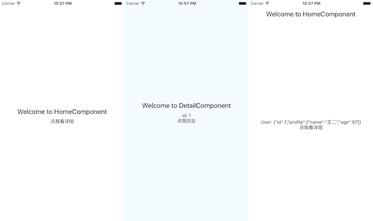
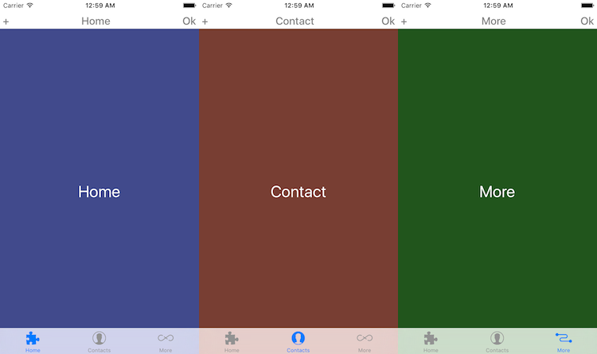
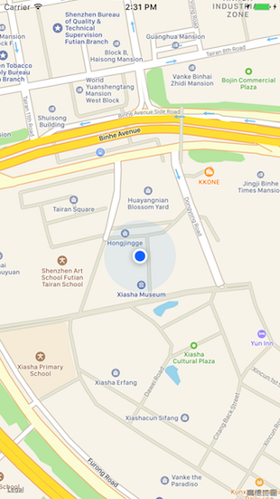
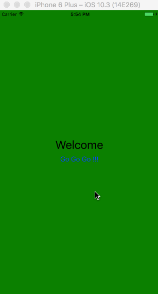

ReactNativePractice
===
ReactNative learn notes and code

**App ICON 生成工具**： [http://icon.wuruihong.com/](http://icon.wuruihong.com/)

### 1. Weekdays

### 2. StopWatch

### 3. Weather

### 4. FindMyLocation

### 5. DatePickerIOS

### 6. Image

### 7. [Navigator](./NavigatorDemo)

### 8. [osmwebview](./osmwebview)

### 9. [ListViewDemo (List && Grid)](./ListViewDemo)

### 10. [TabBarIOSDemo](./TabBarIOSDemo)

### 11. [AirbnbMapDemo](./AirbnbMapDemo)

### 12. [Shaker摇一摇](./Shaker)

### 13. [GesturePassword 手势解锁 iOS](./GesturePassword)

### 14. [react-navigation 页面导航](./ReactNavigationDemo)

