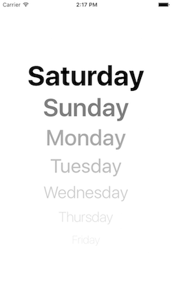

ReactNativePractice
===
ReactNative learn notes and code

###1. Weekdays

###2. StopWatch

###3. Weather

###4. FindMyLocation

###5. DatePickerIOS

###6. Image

###7. [Navigator](./NavigatorDemo)

###8. [osmwebview](./osmwebview)

###9. [ListViewDemo (List && Grid)](./ListViewDemo)

